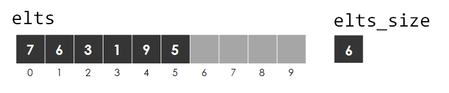

.. qnum::
   :prefix: Q
   :start: 1

.. raw:: html

   

.. raw:: html

   

======================================================================
Containers: Part 1
======================================================================

So far, we've covered a lot of the fundamental tools C++ gives us, as well as some general principles of good programming design, in particular including the design of Abstract Data Types (ADTs).

We're going to shift gears for a while to start taking a look at a variety of data structures and their implementations. The study of data structures essentially leads us to consider the many ways we might organize information and the pros/cons of different strategies for particular tasks.

^^^^^^^^^^^^^^^^^^^^^^^^^^^^^^^^^^^^^^^^^^^^^^^^^^^^^^^^^^^^^^^^^^^^^^
Building a Container ADT to Represent a Set
^^^^^^^^^^^^^^^^^^^^^^^^^^^^^^^^^^^^^^^^^^^^^^^^^^^^^^^^^^^^^^^^^^^^^^
.. section 1

Let's take a look at a data structure to represent a set. We'll be following our normal process for building an ADT - starting with our motivating use cases and the interface we want, followed by a fundamental data representation and invariants, and finally filling in the implementations for each member function.

----------------------------------------------------------------------
Introduction to Sets and the :code:`IntSet` Interface
----------------------------------------------------------------------

.. youtube:: oHqTh9VfrEc
   :divid: ch11_01_vid_intro_to_sets
   :height: 315
   :width: 560
   :align: center

|

----------------------------------------------------------------------
:code:`IntSet` Data Representation
----------------------------------------------------------------------

.. youtube:: K6eRavvlUY0
   :divid: ch11_01_vid_set_data_representation
   :height: 315
   :width: 560
   :align: center

|

----------------------------------------------------------------------
Implmenting the :code:`IntSet` Functions
----------------------------------------------------------------------

.. youtube:: vy07Uesr0i8
   :divid: ch11_01_vid_implementing_intset_functions
   :height: 315
   :width: 560
   :align: center

|

**Exercise**

Implement the :code:`insert()` member function for the :code:`IntSet` class, which adds a given value :code:`v` to the set. First, however, your code should call :code:`contains()` as a helper to check if :code:`v` is already in the set. If the given value is not already in the set, it should add the value to the next available position in the :code:`elts` array and increase :code:`elts_size` by 1. If the value is already in the set, :code:`insert()` does nothing.

Starter code is available on `Lobster <https://lobster.eecs.umich.edu>`_ (:file:`L11.1_IntSet`). The :code:`main()` function provided includes testing code to verify your implementation. Note that you should not worry about implementing :code:`remove()` yet...save that for the next exercise below. 

.. shortanswer:: ch11_01_ex_intset_insert

   Paste your code for the :code:`insert()` function in the box below.

.. admonition:: Walkthrough

   .. reveal:: ch11_01_revealwt_intset_insert
  
      .. youtube:: ajaQVu7oHKM
         :divid: ch11_01_wt_intset_insert
         :height: 315
         :width: 560
         :align: center

|

**Exercise**

Below are some potential implementations of the :code:`remove()` function for :code:`IntSet`. Determine whether each is correct or incorrect. If the implementation is incorrect, explain what the problem is. It may be helpful to trace through the code on this set, removing the :code:`1`, for example:

|

Or, you might also consider pasting them into the Lobster code and uncommenting the additional set of tests in :code:`main()` for the :code:`remove()` function.

.. shortanswer:: ch11_01_ex_intset_remove_01

   .. code-block:: cpp
      
      // Potential Implementation 1
      void remove(int v) {
        int i = indexOf(v);
        if (i == -1) { return; }
        elts[i] = elts[i+1];
        --elts_size;
      }
      
   Is this implementation correct or incorrect? If it's incorrect, what's the problem?

.. shortanswer:: ch11_01_ex_intset_remove_02

   .. code-block:: cpp
      
      // Potential Implementation 2
      void remove(int v) {
        int i = indexOf(v);
        if (i == -1) { return; }
        elts[i] = elts[elts_size-1];
        --elts_size;
      }

      
   Is this implementation correct or incorrect? If it's incorrect, what's the problem?

.. shortanswer:: ch11_01_ex_intset_remove_03

   .. code-block:: cpp
      
      // Potential Implementation 3
      void remove(int v) {
        int i = indexOf(v);
        if (i == -1) { return; }
        elts[i] = elts[0];
        ++elts;
        --elts_size;
      }

      
   Is this implementation correct or incorrect? If it's incorrect, what's the problem?

.. shortanswer:: ch11_01_ex_intset_remove_04

   .. code-block:: cpp
      
      // Potential Implementation 4
      void remove(int v) {
        int i = indexOf(v);
        if (i == -1) { return; }
        for( ; i < elts_size-1 ; ++i) {
          elts[i] = elts[i+1];
        }
        --elts_size;
      }

      
   Is this implementation correct or incorrect? If it's incorrect, what's the problem?

.. shortanswer:: ch11_01_ex_intset_remove_05

   Two of the implementations above for :code:`remove()` work correctly. Which one is the most efficient for sets with lots of elements? How does this fit in with what the representation invariants require (or rather, what they don't require)?

.. admonition:: Walkthrough

   .. reveal:: ch11_01_revealwt_intset_remove
  
      .. youtube:: u3V4L9g_x44
         :divid: ch11_01_wt_intset_remove
         :height: 315
         :width: 560
         :align: center

|

^^^^^^^^^^^^^^^^^^^^^^^^^^^^^^^^^^^^^^^^^^^^^^^^^^^^^^^^^^^^^^^^^^^^^^
Operator Overloads with Member and/or Non-Member Functions
^^^^^^^^^^^^^^^^^^^^^^^^^^^^^^^^^^^^^^^^^^^^^^^^^^^^^^^^^^^^^^^^^^^^^^
.. section 2

You know the only thing cooler than a set ADT? A set ADT with custom operators!

.. youtube:: 8z7QnyRcK0s
   :divid: ch11_02_vid_member_non_member_operator_overloads
   :height: 315
   :width: 560
   :align: center

|

.. TODO

**Exercise**

Let's add a :code:`+=` operator to our :code:`IntSet` class, which allows a nice syntax for adding elements to the set. Here's an example of how we might use it:

.. code-block:: cpp

   class IntSet {
     // operator+= overload
   };
   int main() {
     IntSet set;
     set += 3;
     set += 5;
     cout << set; // {3, 5}
   }

The :code:`+=` operator can be implemented either as a member function overload or a non-member function overload. Consider each of the the potential implementations of :code:`+=` below. For each, indicate whether the :code:`operator+=` overload function is being defined as a member or non-member, and whether or not it is implemented correctly.

.. shortanswer:: ch11_02_ex_intset_plus_equals_operator_01

   .. code-block:: cpp

      // Version 1
      void operator+=(IntSet &s, int v) {
        s.insert(v);
      }

.. shortanswer:: ch11_02_ex_intset_plus_equals_operator_02

   .. code-block:: cpp

      // Version 2
      void IntSet::operator+=(int v) {
        this->insert(v);
      }

.. shortanswer:: ch11_02_ex_intset_plus_equals_operator_03

   .. code-block:: cpp

      // Version 3
      void IntSet::operator+=(IntSet &s, int v) {
        s.insert(v);
      }

.. shortanswer:: ch11_02_ex_intset_plus_equals_operator_04

   .. code-block:: cpp

      // Version 4
      void operator+=(IntSet &s, int v) {
        this->insert(v);
      }

.. shortanswer:: ch11_02_ex_intset_plus_equals_operator_05

   .. code-block:: cpp

      // Version 5
      void IntSet::operator+=(int v) {
        insert(v);
      }

.. admonition:: Walkthrough

   .. reveal:: ch11_02_revealwt_intset_plus_equals_operator
  
      .. youtube:: Z4FmzZ4ppQQ
         :divid: ch11_01_wt_intset_plus_equals_operator
         :height: 315
         :width: 560
         :align: center

|