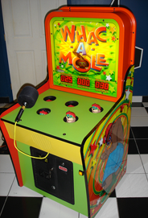

.. qnum::
   :prefix: Q
   :start: 1

.. raw:: html

   

.. raw:: html

   

======================================================================
Memory Models and Dynamic Memory
======================================================================

In today's lecture, we're going to think specifically about the lifetimes we need for different objects in our program, how that corresponds to the way they are managed in memory, and how we as the programmer can use a new technique - **dynamic memory** to have more precise control of all this when we need it.

^^^^^^^^^^^^^^^^^^^^^^^^^^^^^^^^^^^^^^^^^^^^^^^^^^^^^^^^^^^^^^^^^^^^^^
Warm Up Exercise
^^^^^^^^^^^^^^^^^^^^^^^^^^^^^^^^^^^^^^^^^^^^^^^^^^^^^^^^^^^^^^^^^^^^^^
.. section 0

Consider the :code:`Bird` class and code in :code:`main()` below. :code:`Bird` defines a custom constructor (:code:`Bird()`) and destructor (:code:`~Bird()`) that print out a message when they run. Recall that constructors and destructors are special functions that run at the start/end of an object's lifetime...that means thinking about when these functions run (and print their messages!) is a helpful exercise in thinking precisely about their lifetimes in our code.

.. list-table::
  :align: left

  * - .. code-block:: cpp

         Bird b_global(0);

         class Bird {
         private:
           int ID;
         public:
           Bird(int id_in) // custom constructor
            : ID(id_in) {
             cout << "Bird ctor: " << ID << endl;
           }
           
           ~Bird() { // custom destructor
             cout << "Bird dtor: " << ID << endl;
           }
           
           void talk() {
             cout << "tweet" << endl;
           }
         };

    - .. code-block:: cpp

         int main() {
           Bird b1(1);
           for (int i = 0; i < 3; ++i) {
             Bird b2(2);
             b2.talk();
           }
           b1.talk();
           if (100 < 2) {
             Bird b3(3);
             b3.talk();
           }
           else {
             Bird *ptrToB1 = &b1;
             ptrToB1->talk();
           }
         }

.. shortanswer:: ch13_00_ex_bird_lifetimes

   Take a few minutes to mentally trace through the code in :code:`main()` and write down what you think will be printed. Once you're finished, you can find the code on `Lobster <https://lobster.eecs.umich.edu>`_ (:file:`L13.1_Bird_lifetimes`) and use the simulation to double check.

^^^^^^^^^^^^^^^^^^^^^^^^^^^^^^^^^^^^^^^^^^^^^^^^^^^^^^^^^^^^^^^^^^^^^^
Memory Model and Introduction to the Heap
^^^^^^^^^^^^^^^^^^^^^^^^^^^^^^^^^^^^^^^^^^^^^^^^^^^^^^^^^^^^^^^^^^^^^^
.. section 1

.. TODO

.. youtube:: TODO
   :divid: ch12_01_vid_memory_model_and_intro_to_heap
   :height: 315
   :width: 560
   :align: center

|

^^^^^^^^^^^^^^^^^^^^^^^^^^^^^^^^^^^^^^^^^^^^^^^^^^^^^^^^^^^^^^^^^^^^^^
Using the :code:`new` and :code:`delete` Operators
^^^^^^^^^^^^^^^^^^^^^^^^^^^^^^^^^^^^^^^^^^^^^^^^^^^^^^^^^^^^^^^^^^^^^^
.. section 2

.. TODO

.. youtube:: TODO
   :divid: ch12_02_vid_new_and_delete
   :height: 315
   :width: 560
   :align: center

|

.. TODO

**Exercise**

Let's add dynamic memory with :code:`new` and :code:`delete` to another example like the warm up exercise from earlier. Here, we're working with a :code:`Mole` class rather than :code:`Bird`, since all the objects in our program popping up at different places reminds me of the old "Whac-a-Mole" arcade game.

|

.. list-table::
  :align: left

  * - .. code-block:: cpp

         class Mole {
         public:
           Mole(int id_in)
             : id(id_in) {
             cout << "Mole ctor: " << id << endl;
           }
         
           ~Mole() {
             cout << "Mole dtor: " << id << endl;
           }
         
         private:
           int id;
         };
         
         Mole * func() {
           Mole m(123);
           return new Mole(456);
         }

    - .. code-block:: cpp

         int main() {
           Mole m1(1);
           Mole *mPtr;
           // Line 1
           mPtr = func();
           // Line 2
           delete mPtr;
           // Line 3
           mPtr = new Mole(2);
           func();
           // Line 4
           delete mPtr;
           // Line 5
           cout << "all done!" << endl;
         }
         // Line 6 - after main returns

.. fillintheblank:: ch13_02_ex_whac_a_mole
   :casei:

   At each of the commented lines in the code above, indicate how many mole objects are currently alive in memory (i.e. their constructor has run, but their destructor has not run yet).

   Line 1 |blank|
   
   Line 2 |blank|
   
   Line 3 |blank|
   
   Line 4 |blank|
   
   Line 5 |blank|
   
   Line 6 |blank|

   - :1: Correct!
     :.*: Try again
   - :2: Correct!
     :.*: Try again
   - :1: Correct!
     :.*: Try again
   - :3: Correct!
     :.*: Try again
   - :2: Correct!
     :.*: Try again
   - :1: Correct!
     :.*: Try again

.. admonition:: Walkthrough

   .. reveal:: ch13_02_revealwt_whac_a_mole
  
      .. youtube:: TODO
         :divid: ch13_02_wt_whac_a_mole
         :height: 315
         :width: 560
         :align: center

|

^^^^^^^^^^^^^^^^^^^^^^^^^^^^^^^^^^^^^^^^^^^^^^^^^^^^^^^^^^^^^^^^^^^^^^
Dynamic Memory Errors
^^^^^^^^^^^^^^^^^^^^^^^^^^^^^^^^^^^^^^^^^^^^^^^^^^^^^^^^^^^^^^^^^^^^^^
.. section 3

----------------------------------------------------------------------
Memory Leaks
----------------------------------------------------------------------

.. TODO

.. youtube:: TODO
   :divid: ch12_03_vid_memory_leaks
   :height: 315
   :width: 560
   :align: center

|

.. TODO

**Exercise**

.. fillintheblank:: ch13_03_ex_memory_leaks
   :casei:

   How many of the following programs run out of memory and crash? Assume the program has 8KB of stack space and 4MB of heap space. Assume each :code:`int` takes up 4 bytes. Write either "ok" or "crash".
   
   .. list-table::
     :align: left
   
     * - .. code-block:: cpp
         
            int main() {
              int *ptr;
              for (int i = 0; i < 1000000000; ++i) {
                ptr = new int(i);
              }
              delete ptr;
            }
   
       - |blank|
   
     * - .. code-block:: cpp
         
            int main() {
              int x = 10000;
              for (int i = 0; i < 10000; ++i) {
                x = i;
              }
            }
   
       - |blank|
   
     * - .. code-block:: cpp
         
            int main() {
              int arr[10000];
              for (int i = 0; i < 10000; ++i) {
                arr[i] = i;
              }
            }

       - |blank|
   
     * - .. code-block:: cpp
         
            void helper() {
              int *ptr = new int(10);
              ptr = new int(20);
              delete ptr;
            }
            
            int main() {
              for (int i = 0; i < 1000000000; ++i) {
                helper();
              }
            }

       - |blank|
   
       * - .. code-block:: cpp
           
              int main() {
                int *arr = new int[10000];
                for (int i = 0; i < 10000; ++i) {
                  arr[i] = i;
                }
              }

       - |blank|
   
     
   - :.*crash.*: Correct! (The loop allocates many ints with :code:`new`, but there is only one :code:`delete` at the end!)
     :.*: Try again
   - :.*ok.*: Correct! (Storing a large value in a single :code:`int` or processing it many times doesn't take any extra memory.)
     :.*: Try again
   - :.*crash.*: Correct! (The array :code:`arr` is too large at ~40KB to fit on the stack.)
     :.*: Try again
   - :.*crash.*: Correct! (The :code:`helper()` function doesn't clean up all its dynamic memory. Since it is called many times, the program eventually runs out of memory overall!)
     :.*: Try again
   - :.*ok.*: Correct! (The code creates a large array of ~40KB, but it is stored on the heap, which has plenty of memory for that.)
     :.*: Try again

.. admonition:: Walkthrough

   .. reveal:: ch13_03_revealwt_memory_leaks
  
      .. youtube:: TODO
         :divid: ch13_03_wt_memory_leaks
         :height: 315
         :width: 560
         :align: center

|

----------------------------------------------------------------------
Double Free and Non-Heap Delete
----------------------------------------------------------------------

While we have to make sure we clean up all the memory that we create with :code:`new` by cleaning it up using :code:`delete`, we also have to watch out for a few potential errors:

- Deleting an object twice usually results in a crash.
- Deleting a non-heap object usually results in a crash.

**Exercise**

.. fillintheblank:: ch13_03_ex_memory_leaks
   :casei:

   How many of the following programs will likely crash due to one of the two :code:`delete` errors mentioned above? Write either "ok" or "crash".
   
   .. list-table::
     :align: left
   
     * - .. code-block:: cpp
         
            int main() {
              int *ptr1 = new int(1);
              delete ptr1;
              ptr1 = new int(2);
              delete ptr1;
            }

   
       - |blank|
   
     * - .. code-block:: cpp
         
            int main() {
              int *ptr1 = new int(1);
              ptr1 = new int(2);
              delete ptr1;
              delete ptr1;
            }

   
       - |blank|
   
     * - .. code-block:: cpp
         
            int main() {
              int x = 0;
              int *ptr1 = &x;
              delete ptr1;
            }

       - |blank|
   
     * - .. code-block:: cpp
         
            int main() {
              int *ptr1 = new int(1);
              delete &ptr1;
            }

       - |blank|
   
     * - .. code-block:: cpp
         
            int main() {
              int *ptr1 = new int(1);
              int *ptr2 = ptr1;
              delete ptr1;
              delete ptr2;
            }
    
       - |blank|
    
     * - .. code-block:: cpp
         
            int main() {
              int *ptr;
              for (int i = 0; i < 10; ++i) {
                ptr = new int(i);
              }
              for (int i = 0; i < 10; ++i) {
                delete ptr;
              }
            }

       - |blank|
   
     
   - :.*ok.*: Correct! (Although we are deleting *through* :code:`ptr1` twice, it is pointing to a different object each time.)
     :.*: Try again
   - :.*crash.*: Correct! (The code attempts to delete the :code:`int` with value :code:`2` twice.)
     :.*: Try again
   - :.*crash.*: Correct! (:code:`ptr1` was pointing to an :code:`int` on the stack.)
     :.*: Try again
   - :.*crash.*: Correct! (:code:`delete` wants the address of the object to destroy. In this case, the extra :code:`&` means we actually give it the address of the variable :code:`ptr1` itself - not the address of the :code:`int` on the heap.)
     :.*: Try again
   - :.*crash.*: Correct! (Although the two :code:`delete` operations are performed *through* different pointers, they were ultimately pointing to the same object.)
     :.*: Try again
   - :.*crash.*: Correct! (The code creates several objects in the first loop and attempts to destroy them in the second, but it just ends up trying to delete the last of those objects a bunch of times.)
     :.*: Try again

.. admonition:: Walkthrough

   .. reveal:: ch13_03_revealwt_memory_leaks
  
      .. youtube:: TODO
         :divid: ch13_03_wt_memory_leaks
         :height: 315
         :width: 560
         :align: center

|

----------------------------------------------------------------------
Dangling Pointers
----------------------------------------------------------------------

.. TODO

.. youtube:: TODO
   :divid: ch12_03_vid_memory_leaks
   :height: 315
   :width: 560
   :align: center

|

^^^^^^^^^^^^^^^^^^^^^^^^^^^^^^^^^^^^^^^^^^^^^^^^^^^^^^^^^^^^^^^^^^^^^^
What Can You Do With Dynamic Memory?
^^^^^^^^^^^^^^^^^^^^^^^^^^^^^^^^^^^^^^^^^^^^^^^^^^^^^^^^^^^^^^^^^^^^^^
.. section 4

.. TODO

.. youtube:: TODO
   :divid: ch12_04_vid_uses_for_dynamic_memory
   :height: 315
   :width: 560
   :align: center

|