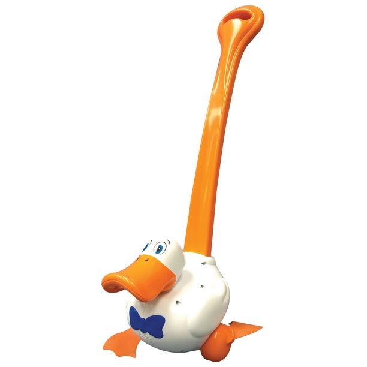
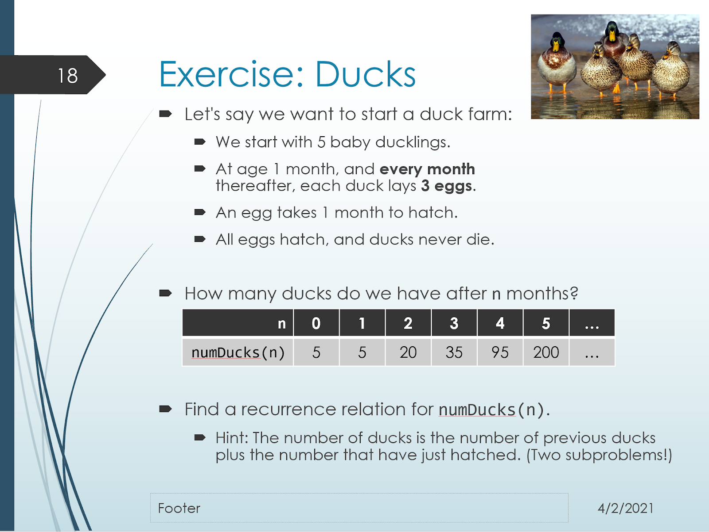

.. qnum::
   :prefix: Q
   :start: 1

.. raw:: html

   

.. raw:: html

   

======================================================================
Recursion and Tail Recursion
======================================================================

Today, we'll look at a fundamentally new way of developing algorithms and writing code using **recursion**. To put it briefly, recursion occurs when we write a function that calls itself. It's a bit hard to describe why this is useful until you get a feel for it, but here's two high level points that eventually resonate:

- Recursion offers a different approach to "repetition" in code without using loops. Perhaps surprisingly, this can be more intuitive for some problems.
- Recursion allows us to model the self-similar structure that naturally exists in many interesting problems and data structures.

^^^^^^^^^^^^^^^^^^^^^^^^^^^^^^^^^^^^^^^^^^^^^^^^^^^^^^^^^^^^^^^^^^^^^^
Introducing Recursion
^^^^^^^^^^^^^^^^^^^^^^^^^^^^^^^^^^^^^^^^^^^^^^^^^^^^^^^^^^^^^^^^^^^^^^
.. section 1

.. youtube:: XU33Xp1yXWk
   :divid: ch18_01_vid_introducing_recursion
   :height: 315
   :width: 560
   :align: center

|

^^^^^^^^^^^^^^^^^^^^^^^^^^^^^^^^^^^^^^^^^^^^^^^^^^^^^^^^^^^^^^^^^^^^^^
Solving Problems with Recursion
^^^^^^^^^^^^^^^^^^^^^^^^^^^^^^^^^^^^^^^^^^^^^^^^^^^^^^^^^^^^^^^^^^^^^^
.. section 2

.. youtube:: mc16okENpfs
   :divid: ch18_02_vid_solving_problems_with_recursion
   :height: 315
   :width: 560
   :align: center

|

Funny story...we've got an exercise about ducks and in the background of that video you can clearly hear (e.g. @ 0:20) my son running around downstairs playing with this:

|

**Exercise**

Here's a copy of the duck exercise slide from the previous video:

|

.. shortanswer:: ch18_02_ex_num_ducks_recurrence

   We already know the value of :math:`ducks(0)` is :math:`5`, because that's the number of ducklings we start with (i.e. "after 0 months").
   
   Write a recurrence relation for the number of ducks after :math:`n` months, :math:`ducks(n) = \;???`. Your recurrence should depend on the value(s) of the two previous months, e.g. :math:`ducks(n-1)` and :math:`ducks(n-2)`. (If you're not sure, feel free to check out the first part of the walkthrough video below.)

.. shortanswer:: ch18_02_ex_num_ducks_code

   Translate your recurrence relation for :math:`numDucks(n)` to code. You can work with the code on `Lobster <https://lobster.eecs.umich.edu>`_ in exercise :file:`L18.4_numDucks` if you like. Paste your finished code below.

.. admonition:: Walkthrough

   .. reveal:: ch18_02_revealwt_num_ducks
  
      .. youtube:: lYcApEDtQX4
         :divid: ch17_02_wt_num_ducks
         :height: 315
         :width: 560
         :align: center

|

^^^^^^^^^^^^^^^^^^^^^^^^^^^^^^^^^^^^^^^^^^^^^^^^^^^^^^^^^^^^^^^^^^^^^^
Reversing an Array with Recursion
^^^^^^^^^^^^^^^^^^^^^^^^^^^^^^^^^^^^^^^^^^^^^^^^^^^^^^^^^^^^^^^^^^^^^^
.. section 3

Let's consider an example of using recursion to processing a data structure - reversing an array. We could do this iteratively with a loop, but what does it look like using recursion?

.. youtube:: GmNvmhOGeDo
   :divid: ch18_03_vid_recursive_array_reverse
   :height: 315
   :width: 560
   :align: center

|

Let's do a bit of brainstorming to come up with a recursive algorithm.

.. shortanswer:: ch18_03_ex_recursive_array_reverse_01

   What base case could we use for reversing an array? What's the "simplest" possible array? What do you need to do to reverse it (if anything)?

.. shortanswer:: ch18_03_ex_recursive_array_reverse_02

   What "subarray" would you reverse using the "recursive leap of faith"?
   
.. shortanswer:: ch18_03_ex_recursive_array_reverse_03

   What do you need to do to finish the problem, assuming the subarray is reversed successfully?

Here's one possible solution:

.. youtube:: 3X7hruWsXJI
   :divid: ch18_03_vid_recursive_array_reverse_solution
   :height: 315
   :width: 560
   :align: center

|

.. shortanswer:: ch18_03_ex_recursive_array_reverse_code
   
   See if you can translate the recurrence from the previous video into code. You can find a setup on `Lobster <https://lobster.eecs.umich.edu>`_ in exercise :file:`L18.5_reverse`. Paste your finished code in the box below.

Here's my solution:

.. youtube:: hLCJO2VdiMo
   :divid: ch18_03_wt_recursive_array_reverse_code
   :height: 315
   :width: 560
   :align: center

|

^^^^^^^^^^^^^^^^^^^^^^^^^^^^^^^^^^^^^^^^^^^^^^^^^^^^^^^^^^^^^^^^^^^^^^
Tail Recursion
^^^^^^^^^^^^^^^^^^^^^^^^^^^^^^^^^^^^^^^^^^^^^^^^^^^^^^^^^^^^^^^^^^^^^^
.. section 4

It turns out that recursion can be less memory-efficient than iteration in some cases due to a proliferation of stack frames. Let's take a look at a strategy called **tail recursion** that allows the compiler to perform optimizations to eliminate the inefficiency (in some cases).

.. youtube:: ioW9LOCr00o
   :divid: ch18_04_vid_tail_recursion
   :height: 315
   :width: 560
   :align: center

|

**Example**: Implementing a Tail Recursive Factorial Function

.. youtube:: hqHgiKwEF9o
   :divid: ch18_04_vid_factorial_tail
   :height: 315
   :width: 560
   :align: center

|